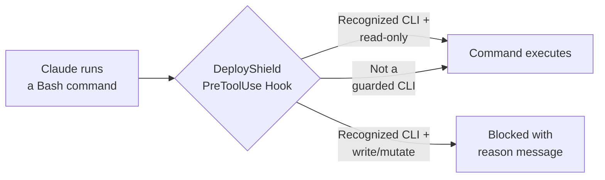

# DeployShield

A Claude Code plugin that acts as a guardrail to prevent write/mutating commands against production environments. DeployShield intercepts Bash commands before execution using deterministic PreToolUse hooks and blocks dangerous operations while allowing read-only commands to pass through.

## How It Works



Every Bash command Claude attempts to run is piped through DeployShield's validation script. If it detects a recognized CLI, it checks the subcommand against a curated safe-list of read-only operations. If the action isn't on the list, it's blocked. Unrecognized commands pass through untouched.

## Supported Providers

### Cloud

| Provider | CLI | Allowed (read-only) | Blocked (examples) |
|----------|-----|---------------------|-------------------|
| **AWS** | `aws` | `describe`, `get`, `list`, `wait`, `help`, `sts get-*`, `s3 ls`, `s3 cp` (download), `configure list`, `sso login` | `run-instances`, `terminate-instances`, `s3 rm`, `s3 cp` (upload) |
| **GCP** | `gcloud` | `describe`, `list`, `info`, `help`, `config list`, `config get-value`, `auth list`, `auth print-*` | `create`, `delete`, `update`, `deploy` |
| **Azure** | `az` | `show`, `list`, `get`, `help`, `account show`, `account list`, `ad signed-in-user show` | `create`, `delete`, `update`, `start`, `stop` |
| **Kubernetes** | `kubectl` | `get`, `describe`, `logs`, `explain`, `api-resources`, `api-versions`, `cluster-info`, `version`, `config view`, `config get-*`, `config current-context`, `auth can-i`, `diff`, `top`, `wait`, any command with `--dry-run` | `apply`, `delete`, `patch`, `edit`, `scale`, `rollout` |
| **Helm** | `helm` | `list`, `ls`, `get`, `show`, `status`, `history`, `search`, `repo list`, `template`, `lint`, `verify`, `version`, `env`, any command with `--dry-run` | `install`, `upgrade`, `uninstall`, `rollback` |

### Databases

| Provider | CLI | Allowed (read-only) | Blocked (examples) |
|----------|-----|---------------------|-------------------|
| **PostgreSQL** | `psql` | `-l`, `-c "SELECT ..."`, `-c "SHOW ..."`, `-c "\dt"` | `-c "DROP TABLE ..."`, `-c "DELETE FROM ..."`, `-f script.sql` |
| **MySQL** | `mysql` | `-e "SELECT ..."`, `-e "SHOW ..."`, `-e "EXPLAIN ..."` | `-e "DROP TABLE ..."`, `-e "DELETE FROM ..."`, `-e "INSERT ..."` |
| **MongoDB** | `mongosh` | `--eval "db.col.find()"`, `--eval "show dbs"` | `--eval "db.col.drop()"`, `--eval "db.col.deleteMany()"`, `-f script.js` |
| **Redis** | `redis-cli` | `GET`, `KEYS`, `SCAN`, `INFO`, `PING`, `TTL`, `HGETALL` | `SET`, `DEL`, `FLUSHALL`, `FLUSHDB`, `CONFIG SET` |

### IaC & Deployment Tools

| Provider | CLI | Allowed (read-only) | Blocked (examples) |
|----------|-----|---------------------|-------------------|
| **Terraform** | `terraform` | `plan`, `show`, `output`, `state list`, `state show`, `state pull`, `validate`, `fmt`, `providers`, `version`, `graph`, `workspace list`, `workspace show`, `init` | `apply`, `destroy`, `import`, `taint`, `untaint` |
| **Pulumi** | `pulumi` | `preview`, `stack ls`, `stack select`, `config get`, `whoami`, `version`, `about` | `up`, `destroy`, `cancel`, `import` |
| **AWS CDK** | `cdk` | `diff`, `synth`, `list`, `doctor`, `version` | `deploy`, `destroy`, `bootstrap` |
| **AWS SAM** | `sam` | `validate`, `build`, `local`, `logs`, `list` | `deploy`, `delete`, `sync` |
| **Serverless** | `serverless`/`sls` | `info`, `print`, `package`, `invoke local` | `deploy`, `remove` |
| **Ansible** | `ansible-playbook` | `--check`, `--syntax-check`, `--list-hosts`, `--list-tasks` | Running without `--check` |

### Secrets, GitHub, Containers & Publishing

| Provider | CLI | Allowed (read-only) | Blocked (examples) |
|----------|-----|---------------------|-------------------|
| **Vault** | `vault` | `read`, `list`, `status`, `version`, `login`, `token lookup`, `kv get` | `write`, `delete`, `seal`, `kv put` |
| **GitHub** | `gh` | `pr view/list`, `issue view/list`, `api` (GET), `repo view/list/clone`, `auth`, `search` | `pr merge/close`, `issue close`, `release create`, `repo delete` |
| **Docker** | `docker`/`podman` | `ps`, `images`, `logs`, `inspect`, `info`, `version`, `stats`, `compose ps/logs` | `rm`, `rmi`, `system prune`, `push`, `stop`, `kill` |
| **npm** | `npm`/`yarn`/`pnpm` | Everything else | `publish`, `unpublish` |
| **PyPI** | `twine` | Everything else | `upload` |
| **RubyGems** | `gem` | Everything else | `push`, `yank` |
| **Cargo** | `cargo` | Everything else | `publish` |

## Edge Cases Handled

DeployShield uses a quote-aware parser that correctly handles:

- **Compound commands** — `echo ok && kubectl apply -f deploy.yaml` blocks the `kubectl apply`
- **Piped commands** — `cat manifest.yaml | kubectl apply -f -` blocks the `kubectl apply`
- **Quoted operators** — `echo "hello && world"` is not split on the `&&`
- **Subshells** — `$(terraform output -json)` inside a larger command is parsed correctly
- **Env var prefixes** — `AWS_PROFILE=prod aws s3 rm ...` is blocked
- **Full binary paths** — `/usr/local/bin/aws ec2 run-instances` is blocked
- **SQL injection in flags** — `psql -c "DROP TABLE users"` is caught and blocked
- **Non-guarded commands** — `git push`, `make build`, etc. pass through without interference

## Context-Aware Blocking

By default, DeployShield blocks ALL write operations for every guarded CLI. If you want to block writes only in specific contexts (e.g. production Kubernetes clusters, the production AWS profile), create a `.deployshield.json` config file.

### Config File Location

Config is loaded from the first location found:

1. `$DEPLOYSHIELD_CONFIG` environment variable (explicit path)
2. `.deployshield.json` in the current working directory (per-project)
3. `~/.deployshield.json` (global)
4. No config file → block everything (current behavior, fully backward-compatible)

### Config Schema

Keys are CLI binary names, values are lists of context patterns ([fnmatch](https://docs.python.org/3/library/fnmatch.html) globs, case-sensitive):

```json
{
  "kubectl": ["prod", "production", "prod-*"],
  "helm": ["prod", "production"],
  "aws": ["production"],
  "terraform": ["production", "default"],
  "gcloud": ["my-prod-project"],
  "az": ["prod-subscription"]
}
```

### Semantics

| Config State | Behavior |
|---|---|
| Provider **not in config** | Blocked everywhere (current default behavior) |
| Provider with patterns (e.g. `["prod", "prod-*"]`) | Blocked **only** when the detected context matches a pattern |
| Provider with empty list (`[]`) | **Never** blocked (disables DeployShield for that CLI) |

When context cannot be detected (e.g. no kubeconfig, no `--context` flag), writes are blocked. This is the secure default — you can't bypass blocking by deleting your kubeconfig.

### Context Detection

| CLI | What's Detected | Sources (in priority order) |
|-----|----------------|----------------------------|
| `kubectl` | Kube context | `--context` flag → `current-context` from kubeconfig |
| `helm` | Kube context | `--kube-context` flag → `current-context` from kubeconfig |
| `aws` | AWS profile | `--profile` flag → `AWS_PROFILE=x` env prefix → `AWS_PROFILE` env var → `"default"` |
| `terraform` | Workspace | `TF_WORKSPACE` env var → `.terraform/environment` file → `"default"` |
| `gcloud` | GCP project | `--project` flag → `CLOUDSDK_CORE_PROJECT` env var |
| `az` | Subscription | `--subscription` flag → `AZURE_SUBSCRIPTION_ID` env var |
| `pulumi` | Stack | `--stack`/`-s` flag |

CLI aliases are resolved automatically: `podman` → `docker`, `mongo` → `mongosh`, `sls` → `serverless`.

### Examples

```bash
# Block kubectl writes only in prod contexts
echo '{"kubectl": ["prod", "prod-*"]}' > .deployshield.json

# In a dev context — writes are allowed:
kubectl --context=dev apply -f deploy.yaml  # ✅ Allowed

# In a prod context — writes are blocked, reads still work:
kubectl --context=prod apply -f deploy.yaml  # ❌ Blocked
kubectl --context=prod get pods              # ✅ Allowed (read-only)

# Disable DeployShield entirely for docker:
echo '{"docker": []}' > .deployshield.json
```

## Installation

### Via Plugin Marketplace (recommended)

Register the marketplace and install:

```bash
claude plugin marketplace add matanryngler/deployshield
claude plugin install deployshield@deployshield
```

### Manual

```bash
git clone https://github.com/matanryngler/deployshield.git
claude --plugin-dir ./deployshield
```

### Verify it's working

Start a new Claude Code session and try a write command — it should be blocked:

```
> kubectl delete pod my-pod
# => Blocked: kubectl 'delete' is not in the safe-list for kubernetes
```

## Project Structure

```
deployshield/
├── .claude-plugin/
│   └── plugin.json                # Plugin manifest
├── hooks/
│   ├── hooks.json                 # Hook event configuration
│   └── scripts/
│       └── validate-cloud-command.py   # Core validation script
├── skills/
│   └── deployshield/
│       └── SKILL.md               # Skill context for Claude
└── README.md
```

| Component | Purpose |
|-----------|---------|
| **plugin.json** | Declares the plugin name, version, and metadata |
| **hooks.json** | Registers two hooks: a PreToolUse hook on Bash commands (runs the validator) and a SessionStart hook (informs Claude that DeployShield is active) |
| **validate-cloud-command.py** | The core validation engine. Parses commands from hook JSON stdin, splits compound commands respecting shell quoting, normalizes binaries, and checks against per-provider safe-lists |
| **SKILL.md** | Activates on infrastructure files to remind Claude which operations are safe and to suggest `--dry-run` / `plan` alternatives |

## How the Validator Works

1. Reads JSON from stdin (`tool_input.command`)
2. Splits the command on `&&`, `||`, `;`, `|` using a state machine that respects single quotes, double quotes, backticks, `$(...)` subshells, and escape characters
3. For each segment, strips env-var prefixes and full binary paths using `shlex`
4. Identifies the CLI binary and dispatches to the provider-specific checker
5. The checker skips global flags to find the subcommand, then matches against the safe-list
6. **Default-deny**: if a guarded CLI is recognized but the action isn't safe-listed, the command is blocked
7. Non-guarded commands are always allowed

## Requirements

- Python 3.8+ (used by the validation script; ships with macOS and most Linux distros)
- Claude Code with plugin support

## Testing

You can test the validator directly by piping JSON to stdin:

```bash
# Should be allowed (exit 0, no output)
echo '{"tool_input":{"command":"aws s3 ls"}}' | ./hooks/scripts/validate-cloud-command.py
echo '{"tool_input":{"command":"kubectl get pods"}}' | ./hooks/scripts/validate-cloud-command.py
echo '{"tool_input":{"command":"psql -c \"SELECT * FROM users\""}}' | ./hooks/scripts/validate-cloud-command.py

# Should be denied (prints JSON with permissionDecision: deny)
echo '{"tool_input":{"command":"terraform apply"}}' | ./hooks/scripts/validate-cloud-command.py
echo '{"tool_input":{"command":"psql -c \"DROP TABLE users\""}}' | ./hooks/scripts/validate-cloud-command.py
echo '{"tool_input":{"command":"docker system prune"}}' | ./hooks/scripts/validate-cloud-command.py
echo '{"tool_input":{"command":"npm publish"}}' | ./hooks/scripts/validate-cloud-command.py
echo '{"tool_input":{"command":"gh pr merge 123"}}' | ./hooks/scripts/validate-cloud-command.py

# Non-guarded command - always allowed
echo '{"tool_input":{"command":"npm test"}}' | ./hooks/scripts/validate-cloud-command.py
```

## License

MIT
