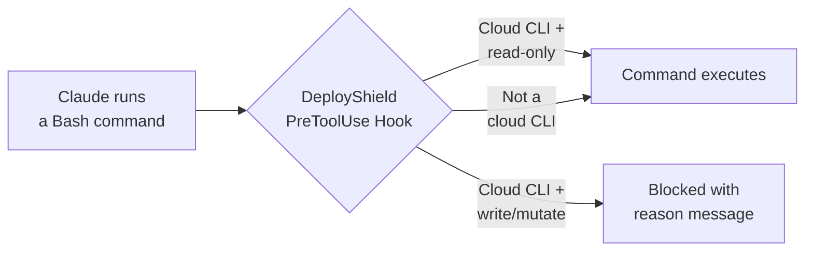

# DeployShield

A Claude Code plugin that acts as a guardrail to prevent write/mutating commands against production cloud environments. DeployShield intercepts Bash commands before execution using deterministic PreToolUse hooks and blocks dangerous operations while allowing read-only commands to pass through.

## How It Works



Every Bash command Claude attempts to run is piped through DeployShield's validation script. If it detects a recognized cloud CLI, it checks the subcommand against a curated safe-list of read-only operations. If the action isn't on the list, it's blocked. Non-cloud commands pass through untouched.

## Supported Providers

| Provider | CLI | Allowed (read-only) | Blocked (examples) |
|----------|-----|---------------------|-------------------|
| **AWS** | `aws` | `describe`, `get`, `list`, `wait`, `help`, `sts get-*`, `s3 ls`, `s3 cp` (download), `configure list`, `sso login` | `run-instances`, `terminate-instances`, `s3 rm`, `s3 cp` (upload) |
| **GCP** | `gcloud` | `describe`, `list`, `info`, `help`, `config list`, `config get-value`, `auth list`, `auth print-*` | `create`, `delete`, `update`, `deploy` |
| **Azure** | `az` | `show`, `list`, `get`, `help`, `account show`, `account list`, `ad signed-in-user show` | `create`, `delete`, `update`, `start`, `stop` |
| **Kubernetes** | `kubectl` | `get`, `describe`, `logs`, `explain`, `api-resources`, `api-versions`, `cluster-info`, `version`, `config view`, `config get-*`, `config current-context`, `auth can-i`, `diff`, `top`, `wait` | `apply`, `delete`, `patch`, `edit`, `scale`, `rollout` |
| **Helm** | `helm` | `list`, `ls`, `get`, `show`, `status`, `history`, `search`, `repo list`, `template`, `lint`, `verify`, `version`, `env` | `install`, `upgrade`, `uninstall`, `rollback` |
| **Terraform** | `terraform` | `plan`, `show`, `output`, `state list`, `state show`, `state pull`, `validate`, `fmt`, `providers`, `version`, `graph`, `workspace list`, `workspace show`, `init` | `apply`, `destroy`, `import`, `taint`, `untaint` |
| **Pulumi** | `pulumi` | `preview`, `stack ls`, `stack select`, `config get`, `whoami`, `version`, `about` | `up`, `destroy`, `cancel`, `import` |

## Edge Cases Handled

DeployShield uses a quote-aware parser that correctly handles:

- **Compound commands** - `echo ok && kubectl apply -f deploy.yaml` blocks the `kubectl apply`
- **Piped commands** - `cat manifest.yaml | kubectl apply -f -` blocks the `kubectl apply`
- **Quoted operators** - `echo "hello && world"` is not split on the `&&`
- **Subshells** - `$(terraform output -json)` inside a larger command is parsed correctly
- **Env var prefixes** - `AWS_PROFILE=prod aws s3 rm ...` is blocked
- **Full binary paths** - `/usr/local/bin/aws ec2 run-instances` is blocked
- **Non-cloud commands** - `npm test`, `git push`, `docker build` pass through without interference

## Installation

### As a plugin directory

```bash
claude --plugin-dir /path/to/deployshield
```

### In your project

Clone or copy into your project and reference it:

```bash
git clone https://github.com/matanryngler/deployshield.git
claude --plugin-dir ./deployshield
```

### Verify it's working

Launch with debug mode to confirm hooks are registered:

```bash
claude --plugin-dir /path/to/deployshield --debug
```

You should see DeployShield's SessionStart hook fire, and any cloud write commands will be blocked with a clear message.

## Project Structure

```
deployshield/
├── .claude-plugin/
│   └── plugin.json                # Plugin manifest
├── hooks/
│   ├── hooks.json                 # Hook event configuration
│   └── scripts/
│       └── validate-cloud-command.sh   # Core validation script (Python)
├── skills/
│   └── deployshield/
│       └── SKILL.md               # Skill context for Claude
└── README.md
```

| Component | Purpose |
|-----------|---------|
| **plugin.json** | Declares the plugin name, version, and metadata |
| **hooks.json** | Registers two hooks: a PreToolUse hook on Bash commands (runs the validator) and a SessionStart hook (informs Claude that DeployShield is active) |
| **validate-cloud-command.sh** | The core validation engine. Parses commands from hook JSON stdin, splits compound commands respecting shell quoting, normalizes binaries, and checks against per-provider safe-lists |
| **SKILL.md** | Activates on infrastructure files (`.tf`, `.yaml`, Helm charts, etc.) to remind Claude which operations are safe and to suggest `--dry-run` / `plan` alternatives |

## How the Validator Works

1. Reads JSON from stdin (`tool_input.command`)
2. Splits the command on `&&`, `||`, `;`, `|` using a state machine that respects single quotes, double quotes, backticks, `$(...)` subshells, and escape characters
3. For each segment, strips env-var prefixes and full binary paths using `shlex`
4. Identifies the cloud CLI binary and dispatches to the provider-specific checker
5. The checker skips global flags to find the subcommand, then matches against the safe-list
6. **Default-deny**: if a cloud CLI is recognized but the action isn't safe-listed, the command is blocked
7. Non-cloud commands are always allowed

## Requirements

- Python 3.8+ (used by the validation script; ships with macOS and most Linux distros)
- Claude Code with plugin support

## Testing

You can test the validator directly by piping JSON to stdin:

```bash
# Should be allowed (exit 0, no output)
echo '{"tool_input":{"command":"aws s3 ls"}}' | ./hooks/scripts/validate-cloud-command.sh

# Should be denied (prints JSON with permissionDecision: deny)
echo '{"tool_input":{"command":"aws ec2 terminate-instances --instance-ids i-123"}}' | ./hooks/scripts/validate-cloud-command.sh

# Compound command - denied because of kubectl apply
echo '{"tool_input":{"command":"echo hello && kubectl apply -f deploy.yaml"}}' | ./hooks/scripts/validate-cloud-command.sh

# Non-cloud command - always allowed
echo '{"tool_input":{"command":"npm test"}}' | ./hooks/scripts/validate-cloud-command.sh
```

## License

MIT
