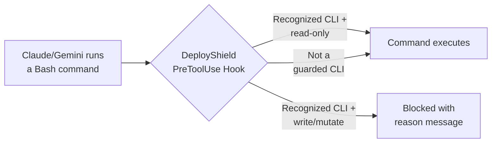

# 🛡️ DeployShield

[](https://github.com/matanryngler/deployshield/actions/workflows/test.yml)
[](https://github.com/matanryngler/deployshield/releases)
[](https://opensource.org/licenses/MIT)
[](https://www.python.org/downloads/)

Production safety guardrails for **Claude Code** and **Gemini CLI**.

DeployShield is a deterministic safety layer for AI-driven development. It intercepts Bash commands before execution using deterministic PreToolUse hooks and blocks dangerous operations while allowing read-only commands to pass through.

## Why DeployShield?

DeployShield is a deterministic safety layer for AI-driven development. While Large Language Models (LLMs) are powerful, they are not infallible. DeployShield ensures that:

- **🛡️ Accidental Mutations are Blocked**: Commands that could delete, terminate, or modify production resources are intercepted before execution.
- **⚡ Deterministic, Not Probabilistic**: Unlike "system prompt instructions" which an LLM can ignore, DeployShield uses hardcoded, rule-based validation.
- **🔍 Read-Only Freedom**: You can still use all the read-only commands (`get`, `list`, `describe`) to inspect your environments without friction.
- **🌐 Context-Aware**: Use `.deployshield.json` to define when to be strict (e.g., `prod-cluster`) and when to be relaxed (e.g., `dev-cluster`).

## Cross-Platform Support

DeployShield works across the most popular AI CLI agents:

| Agent | Integration | Benefits |
|-------|-------------|----------|
| **Claude Code** | Native Plugin | PreToolUse hooks intercept every `bash` command before it hits your terminal. |
| **Gemini CLI** | Native Skill | Uses the same core validator to provide consistent safety guardrails. |

## How It Works


```mermaid
flowchart LR
    A["Claude/Gemini runs\na Bash command"] --> B{"DeployShield\nPreToolUse Hook"}
    B -->|"Recognized CLI +\nread-only"| C["Command executes"]
    B -->|"Not a\nguarded CLI"| C
    B -->|"Recognized CLI +\nwrite/mutate"| D["Blocked with\nreason message"]
```

Every Bash command the AI attempts to run is piped through DeployShield's validation script. If it detects a recognized CLI, it checks the subcommand against a curated safe-list of read-only operations. If the action isn't on the list, it's blocked. Unrecognized commands pass through untouched.

## Supported Providers

### ☁️ Cloud & Infrastructure

| Provider | CLI | Allowed (read-only) | Blocked (examples) |
|----------|-----|---------------------|-------------------|
| **AWS** | `aws` | `describe`, `get`, `list`, `wait`, `help`, `sts get-*`, `s3 ls`, `s3 cp` (download), `configure list`, `sso login` | `run-instances`, `terminate-instances`, `s3 rm`, `s3 cp` (upload) |
| **GCP** | `gcloud` | `describe`, `list`, `info`, `help`, `config list`, `config get-value`, `auth list`, `auth print-*` | `create`, `delete`, `update`, `deploy` |
| **Azure** | `az` | `show`, `list`, `get`, `help`, `account show`, `account list`, `ad signed-in-user show` | `create`, `delete`, `update`, `start`, `stop` |
| **Kubernetes** | `kubectl` | `get`, `describe`, `logs`, `explain`, `api-resources`, `api-versions`, `cluster-info`, `version`, `config view`, `config get-*`, `config current-context`, `auth can-i`, `diff`, `top`, `wait`, any command with `--dry-run` | `apply`, `delete`, `patch`, `edit`, `scale`, `rollout` |
| **Helm** | `helm` | `list`, `ls`, `get`, `show`, `status`, `history`, `search`, `repo list`, `template`, `lint`, `verify`, `version`, `env`, any command with `--dry-run` | `install`, `upgrade`, `uninstall`, `rollback` |

### 🗄️ Databases

| Provider | CLI | Allowed (read-only) | Blocked (examples) |
|----------|-----|---------------------|-------------------|
| **PostgreSQL** | `psql` | `-l`, `-c "SELECT ..."`, `-c "SHOW ..."`, `-c "\dt"` | `-c "DROP TABLE ..."`, `-c "DELETE FROM ..."`, `-f script.sql` |
| **MySQL** | `mysql` | `-e "SELECT ..."`, `-e "SHOW ..."`, `-e "EXPLAIN ..."` | `-e "DROP TABLE ..."`, `-e "DELETE FROM ..."`, `-e "INSERT ..."` |
| **MongoDB** | `mongosh` | `--eval "db.col.find()"`, `--eval "show dbs"` | `--eval "db.col.drop()"`, `--eval "db.col.deleteMany()"`, `-f script.js` |
| **Redis** | `redis-cli` | `GET`, `KEYS`, `SCAN`, `INFO`, `PING`, `TTL`, `HGETALL` | `SET`, `DEL`, `FLUSHALL`, `FLUSHDB`, `CONFIG SET` |

### 🏗️ IaC & Deployment Tools

| Provider | CLI | Allowed (read-only) | Blocked (examples) |
|----------|-----|---------------------|-------------------|
| **Terraform** | `terraform` | `plan`, `show`, `output`, `state list`, `state show`, `state pull`, `validate`, `fmt`, `providers`, `version`, `graph`, `workspace list`, `workspace show`, `init` | `apply`, `destroy`, `import`, `taint`, `untaint` |
| **Pulumi** | `pulumi` | `preview`, `stack ls`, `stack select`, `config get`, `whoami`, `version`, `about` | `up`, `destroy`, `cancel`, `import` |
| **AWS CDK** | `cdk` | `diff`, `synth`, `list`, `doctor`, `version` | `deploy`, `destroy`, `bootstrap` |
| **AWS SAM** | `sam` | `validate`, `build`, `local`, `logs`, `list` | `deploy`, `delete`, `sync` |
| **Serverless** | `serverless`/`sls` | `info`, `print`, `package`, `invoke local` | `deploy`, `remove` |
| **Ansible** | `ansible-playbook` | `--check`, `--syntax-check`, `--list-hosts`, `--list-tasks` | Running without `--check` |

### 🔐 Secrets, GitHub, Containers & Publishing

| Provider | CLI | Allowed (read-only) | Blocked (examples) |
|----------|-----|---------------------|-------------------|
| **Vault** | `vault` | `read`, `list`, `status`, `version`, `login`, `token lookup`, `kv get` | `write`, `delete`, `seal`, `kv put` |
| **GitHub** | `gh` | `pr view/list`, `issue view/list`, `api` (GET), `repo view/list/clone`, `auth`, `search` | `pr merge/close`, `issue close`, `release create`, `repo delete` |
| **Docker** | `docker`/`podman` | `ps`, `images`, `logs`, `inspect`, `info`, `version`, `stats`, `compose ps/logs` | `rm`, `rmi`, `system prune`, `push`, `stop`, `kill` |
| **npm** | `npm`/`yarn`/`pnpm` | Everything else | `publish`, `unpublish` |
| **PyPI** | `twine` | Everything else | `upload` |
| **RubyGems** | `gem` | Everything else | `push`, `yank` |
| **Cargo** | `cargo` | Everything else | `publish` |

## Core Features

### 🛡️ Recursive Safety
DeployShield provides deep protection through recursive validation:
- **Subshells & Backticks**: Validates commands inside `$(...)` and `` `...` ``.
- **Process Substitution**: Validates commands inside `<(...)` and `>(...)`.
- **Administrative Wrappers**: Transparently unwraps `sudo` and `env` to check the underlying command.
- **Shell Wrappers**: Recursively validates command strings passed to `bash -c` and `sh -c`.

### 🌐 Context-Aware Blocking
By default, DeployShield blocks ALL write operations for every guarded CLI. If you want to block writes only in specific contexts (e.g. production Kubernetes clusters, the production AWS profile), create a `.deployshield.json` config file.

#### Config File Location
Config is loaded from the first location found:
1. `$DEPLOYSHIELD_CONFIG` environment variable (explicit path)
2. `.deployshield.json` in the current working directory (per-project)
3. `~/.deployshield.json` (global)

#### Context Detection Examples
| CLI | What's Detected | Sources (in priority order) |
|-----|----------------|----------------------------|
| `kubectl` | Kube context | `--context` flag → `current-context` from kubeconfig |
| `aws` | AWS profile | `--profile` flag → `AWS_PROFILE=x` env prefix → `AWS_PROFILE` env var → `"default"` |
| `terraform` | Workspace | `TF_WORKSPACE` env var → `.terraform/environment` file → `"default"` |

## Edge Cases Handled

DeployShield uses a quote-aware parser that correctly handles:

- **Compound commands** — `echo ok && kubectl apply -f deploy.yaml` blocks the `kubectl apply`
- **Piped commands** — `cat manifest.yaml | kubectl apply -f -` blocks the `kubectl apply`
- **Quoted operators** — `echo "hello && world"` is not split on the `&&`
- **Subshells** — `$(terraform output -json)` inside a larger command is parsed correctly
- **Env var prefixes** — `AWS_PROFILE=prod aws s3 rm ...` is blocked
- **Full binary paths** — `/usr/local/bin/aws ec2 run-instances` is blocked
- **SQL injection in flags** — `psql -c "DROP TABLE users"` is caught and blocked
- **Non-guarded commands** — `git push`, `make build`, etc. pass through without interference

## Installation

### For Claude Code (via Plugin Marketplace)

Register the marketplace and install:

```bash
claude plugin marketplace add matanryngler/deployshield
claude plugin install deployshield@deployshield
```

### For Gemini CLI (via Skills)

```bash
gemini --skill-dir ./skills/gemini
```

### Manual

```bash
git clone https://github.com/matanryngler/deployshield.git
claude --plugin-dir ./deployshield
```

## How the Validator Works

1. Reads JSON from stdin (`tool_input.command`)
2. Splits the command on `&&`, `||`, `;`, `|` using a state machine that respects single quotes, double quotes, backticks, `$(...)` subshells, and escape characters
3. For each segment, strips env-var prefixes and full binary paths using `shlex`
4. Identifies the CLI binary and dispatches to the provider-specific checker
5. The checker skips global flags to find the subcommand, then matches against the safe-list
6. **Default-deny**: if a guarded CLI is recognized but the action isn't safe-listed, the command is blocked
7. Non-guarded commands are always allowed

## Requirements

- Python 3.9+ (used by the validation script)
- Claude Code or Gemini CLI

## Testing

You can test the validator directly by piping JSON to stdin:

```bash
# Should be allowed (exit 0, no output)
echo '{"tool_input":{"command":"aws s3 ls"}}' | ./hooks/scripts/validate-cloud-command.py
echo '{"tool_input":{"command":"kubectl get pods"}}' | ./hooks/scripts/validate-cloud-command.py
echo '{"tool_input":{"command":"psql -c \"SELECT * FROM users\""}}' | ./hooks/scripts/validate-cloud-command.py

# Should be denied (prints JSON with permissionDecision: deny)
echo '{"tool_input":{"command":"terraform apply"}}' | ./hooks/scripts/validate-cloud-command.py
echo '{"tool_input":{"command":"psql -c \"DROP TABLE users\""}}' | ./hooks/scripts/validate-cloud-command.py
echo '{"tool_input":{"command":"docker system prune"}}' | ./hooks/scripts/validate-cloud-command.py
echo '{"tool_input":{"command":"npm publish"}}' | ./hooks/scripts/validate-cloud-command.py
echo '{"tool_input":{"command":"gh pr merge 123"}}' | ./hooks/scripts/validate-cloud-command.py

# Non-guarded command - always allowed
echo '{"tool_input":{"command":"npm test"}}' | ./hooks/scripts/validate-cloud-command.py
```

## Project Structure

```
deployshield/
├── .claude-plugin/
│   └── plugin.json                # Plugin manifest
├── hooks/
│   ├── hooks.json                 # Hook event configuration
│   └── scripts/
│       └── validate-cloud-command.py   # Core validation script
├── skills/
│   ├── deployshield/
│   │   └── SKILL.md               # Skill context for Claude
│   └── gemini/
│       └── SKILL.md               # Skill context for Gemini
└── README.md
```

## License

MIT
